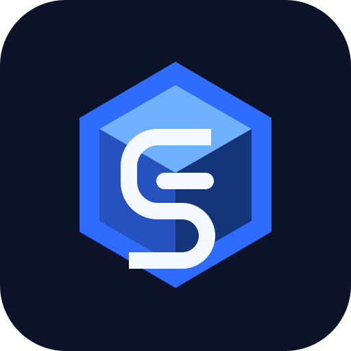

<div align="center">
  
</div>

<br />

<h3 align="center">216labs</h3>

<p align="center">
  <em>From the slop, structure will emerge</em>
</p>

<p align="center">
  <a href="https://6cubed.app">6cubed.app</a>
</p>

---

**Vibe coding** with AI is a superpower: you can spin up surfaces, APIs, and experiments at a pace that used to be unthinkable. The catch is entropy — without a well-thought out production-grade shell around everything from day 1, vibe coding doesn't scale.

216Labs is building that shell. We've iterated on a 100+ app portfolio and figured out what large vibe coded codebases need to survive and thrive, and we're open sourcing the shell so it can work for you too.

We believe in a world where LLMs can guarantee incremental improvements to software projects for every next-token they sample, ultimately leading to the infinite internet improvement era.

## Work with us

Need a production web app, an AI-feature retainer, or a specialist **audio/ML pilot** (CARFAC on hydrophone, drone, and bird audio)? One buyer is enough — [hire the lab](https://6cubed.app/#work). Proof: [CARFAC SAI on underwater audio](https://blog.6cubed.app/blog/carfac-underwater-sai). Pilot scope: [CARFAC pilots](docs/CARFAC-PILOTS.md).

## Get started (plug and play)

**Requires:** Docker Desktop (or Docker Engine + Compose V2) and Python 3.

```bash
git clone https://github.com/6cubed/216labs.git
cd 216labs
./scripts/bootstrap-toolkit.sh
```

Then open:

| URL | What |
|-----|------|
| http://localhost/ | Landing |
| http://admin.localhost/ | Admin (password printed by the script) |
| http://hello-nextjs.localhost/ | Minimal Next.js demo |
| http://hello-flask.localhost/ | Minimal Flask demo |

Add an app: `./scripts/new-app.sh myapp nextjs` — see [`docs/TOOLKIT.md`](docs/TOOLKIT.md) and [`scripts/ADDING_AN_APP.md`](scripts/ADDING_AN_APP.md).

Handbook (layout, deploy, ops): [`docs/REPOSITORY.md`](docs/REPOSITORY.md).
